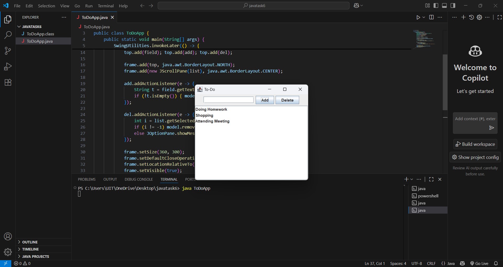

# swing-todo-list-app

## Description
This is a simple To-Do List desktop application developed using Java Swing.  
It allows users to add new tasks, delete selected tasks, and manage their task list with an easy-to-use GUI.  
The project is designed to help beginners understand Java Swing components such as JFrame, JButton, and JTextField, along with event handling.

## Screenshot


## How to Run
1. Clone this repository.  
2. Open the project in IntelliJ IDEA or Eclipse.  
3. Run the `ToDoApp.java` file.  
4. Or, from the terminal:
```bash
   javac ToDoApp.java
   java ToDoApp
```


## Author
Sudhatanmai

---

Thanks for visiting my Java Swing To-Do List project!  
Feel free to reach out with any questions or feedback. 🙂
